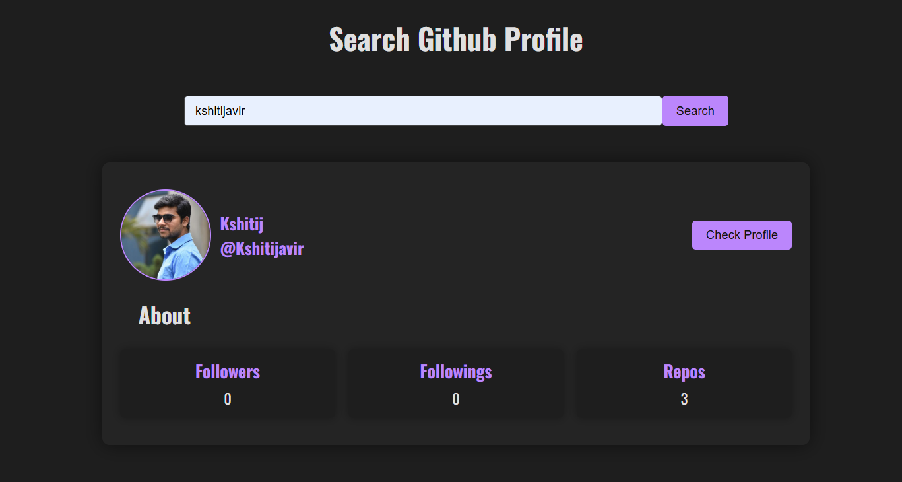

<h2 align="center">
Search-Github-Profile - v2.0 
</h2>

 
 
 

 
 &nbsp;
 &nbsp;
 &nbsp;
 &nbsp;

 

 
<h3 align="center">
    🔹
<a href="https://github.com/Kshitijavir/Search-Github-Profile/issues">Report Bug</a> &nbsp; &nbsp;
    🔹
<a href="https://github.com/Kshitijavir/Search-Github-Profile/issues">Request Feature</a>
</h3>
 
## TL;DR
 
You can fork this repo to modify and make changes of your own. Please give me proper credit by linking back to [ManojParkale](https://github.com/Kshitijavir/Search-Github-Profile). Thanks!
 
## Built With
 
My personal portfolio features some of my github projects as well as my resume and technical skills. 
 
This project was built using these technologies.
 
- Javascript
- HTML
- CSS
- VsCode
 
## Features
 
**📖 Single-Page Layout**
 
**🎨 Styled with CSS, easy to customize colors**
 
**📱 Fully Responsive**
 
The page will reload if you make edits.
You will find all the components used and you can edit your information accordingly.
